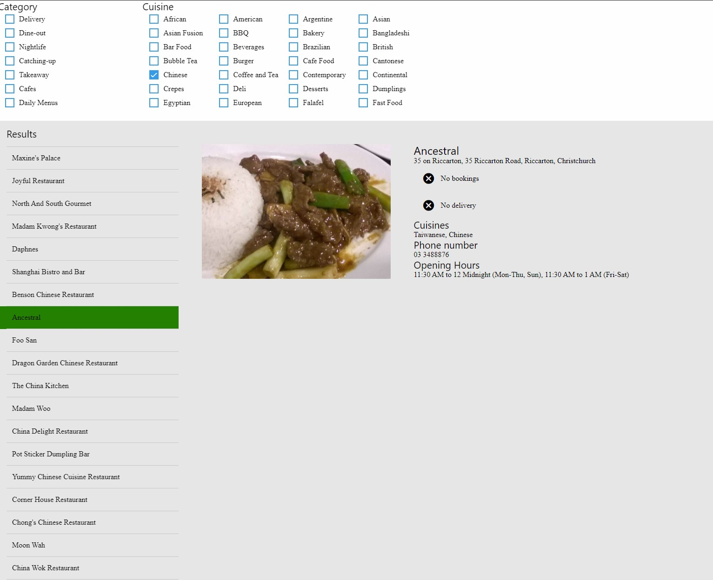

# kathmandu-test
Use the Zomato API to build a restaurant navigator and viewer.

# Dependencies
- [Native Base](https://docs.nativebase.io/Components.html#Components) - UI kit
- [Expo](https://expo.io) - React Native app container and managed workflow
- [Redux](redux.js.org) - Local state management

# Get started
1. Have Yarn or NPM installed on your environment
2. Run `yarn` or `npm install` in the project root directory
3. If you do not have `expo-cli` installed, `yarn global add expo-cli` or `npm install -g expo-cli`
4. Start the web server `yarn web` or `npx web`
5. The web server will start, and should open up a browser window when it's completed

